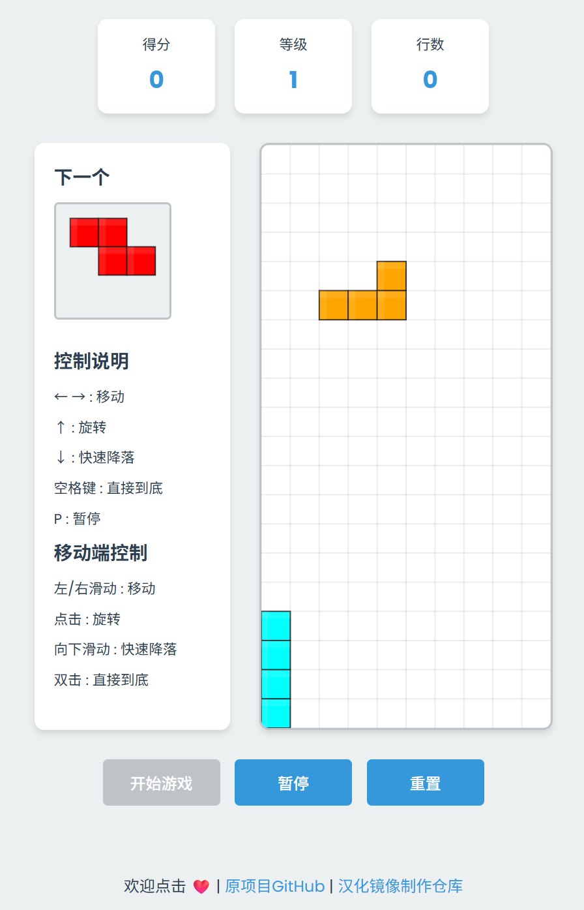

# 俄罗斯方块

[原项目README](README-原项目.md)

- 原项目地址
   - 官网 https://musthofa-kamaluddin.github.io/Tetris/
  - GitHub仓库 https://github.com/musthofa-kamaluddin/Tetris
- 我汉化和构建docker镜像的仓库
  - GitHub仓库 https://github.com/Firfr/tetris-3_zh
  - Gitee仓库 https://gitee.com/firfe/tetris-3_zh

## 汉化&修改&镜像制作

如果镜像拉取失败，请B站发私信，或提issues，  
华为云上的镜像仓库默认推送的镜像不是公开的，有可能是我忘记设置公开了。

当前制作镜像版本(或截止更新日期)：

首先感谢原作者的开源。  
原项目没有中文和docker镜像，我汉化和制作了docker镜像。

具体汉化了那些内容，请参考[翻译说明](./翻译说明.md)。

只做了汉化和简单修改，有问题，请到原作者仓库处反馈。

欢迎关注我B站账号 [秦曱凧](https://space.bilibili.com/17547201) (读作 qín yuē zhēng)  

有需要帮忙部署这个项目的朋友,一杯奶茶,即可程远程帮你部署，需要可联系。  
微信号 `E-0_0-`  
闲鱼搜索用户 `明月人间`  
或者邮箱 `firfe163@163.com`  
如果这个项目有帮到你。欢迎start。

### 镜像

从阿里云或华为云镜像仓库拉取镜像，注意填写镜像标签，镜像仓库中没有`latest`标签

容器内部端口`5154`，可通过设置启动参数的值来指定监听端口。

- 国内镜像
  - AMD64镜像
    ```bash
    swr.cn-north-4.myhuaweicloud.com/firfe/tetris-3_zh:2025.10.05
    ```
  - ARM64镜像
    ```bash
    swr.cn-north-4.myhuaweicloud.com/firfe/tetris-3_zh:2025.10.05-arm64
    ```
- DockerHub镜像
  - AMD64镜像
    ```bash
    firfe/tetris-3_zh:2025.10.05
    ```
  - ARM64镜像
    ```bash
    firfe/tetris-3_zh:2025.10.05-arm64
    ```


### docker run 命令部署

```bash
docker run -d \
--name tetris-3_zh \
--network bridge \
--restart always \
--log-opt max-size=1m \
--log-opt max-file=1 \
-p 5154:5154 \
swr.cn-north-4.myhuaweicloud.com/firfe/tetris-3_zh:2025.10.05
```
在命令最后追加`-p 端口`自定义端口

### compose 文件部署 👍推荐

```yaml
#version: '3'
name: tetris-3_zh
services:
  tetris-3_zh:
    container_name: tetris-3_zh
    image: swr.cn-north-4.myhuaweicloud.com/firfe/tetris-3_zh:2025.10.05
    network_mode: bridge
    restart: always
    logging:
      options:
        max-size: 1m
        max-file: '1'
    ports:
      - 5154:5154
    # 指定端口
    # command: ["-p", "自定义端口"] 
```

### 修改说明

增加修改部分具体见 [修改说明](./修改说明.md)。

原项目`README.md`重命名为`README-原项目.md`

增加目录 `./图片` `./remote_files`(引用的远程文件)
新增文件 `README.md`、`./.dockerignore`、`./Dockerfile`、`./翻译说明.md`、`./修改说明.md`

### 效果截图



